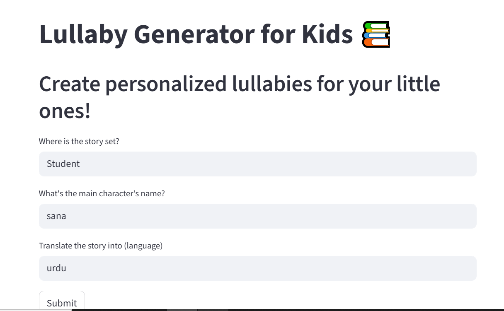

# **Lullaby Generator for Kids**



This project is a **Lullaby Generator** web application built using **Streamlit** and **LangChain**. It allows users to create personalized lullabies based on a child's name, location, and language preference. The app generates a simple, short lullaby and then translates it into the desired language, making bedtime more magical for little ones.

## **Features**

* **Personalized Lullaby**: Generate a lullaby based on a child's name and the location where the story is set.
* **Language Translation**: Translate the lullaby into the specified language, with a focus on keeping the language simple and fun for children.
* **Streamlit Interface**: A user-friendly interface to input details and view the generated lullaby and its translation.

## **Technologies Used**

* **Streamlit**: A framework to build the interactive web application.
* **LangChain**: A powerful framework for chaining large language models to process data, including creating a lullaby and translating it.
* **OllamaLLM**: A pre-trained model used to generate stories and perform translations.
* **Pandas**: For managing data (optional in the code, though useful for scaling the app with more features).
* **PyPDF**: For potential document processing (though not directly used in this version).
* **Regex**: For text pattern matching (used in the background if required for data validation).

## **How It Works**

1. **Personalized Lullaby Creation**: Users input a child's name, the setting of the story (location), and a desired language for translation. The app uses a pre-trained language model to generate a short lullaby based on these inputs.

2. **Translation**: After generating the lullaby in English, the app translates it into the specified language while keeping the tone simple and fun for children.

3. **Display**: The original lullaby and its translation are shown in separate expandable sections.

## **Setup Instructions**

1. **Clone the Repository:**

   ```bash
   git clone https://github.com/your-username/lullaby-generator.git
   cd lullaby-generator
   ```

2. **Set Up Environment Variables:**

   Create a `.env` file in the project root directory and add any required API keys for HuggingFace models or LangChain.

3. **Run the Streamlit App:**

   Once the dependencies are installed and the environment variables are set up, run the app using:

   ```bash
   streamlit run app.py
   ```

   The app will be accessible at `http://localhost:8501`.

## **File Structure**

```
.
├── app.py                # Main Streamlit application file
├── .env                  # Environment variables (if required)
└── README.md             # This README file
```

## **Dependencies**

The required dependencies are listed in the `requirements.txt` file:

```txt
streamlit
langchain
langchain_community
transformers
pandas
regex
```

## **How to Use the App**

1. Open the app in your browser (running at `http://localhost:8501`).
2. Enter the **location** where the lullaby is set, the **main character's name**, and the **language** for translation.
3. Click the **Submit** button to generate the lullaby.
4. The app will display the English version of the lullaby along with its translation in the selected language.


## **Adding Additional Features**

* **More Languages**: You can enhance the translation features by integrating additional translation models or APIs.
* **Lullaby Customization**: Allow users to input specific themes, animals, or words to personalize the lullaby even more.
